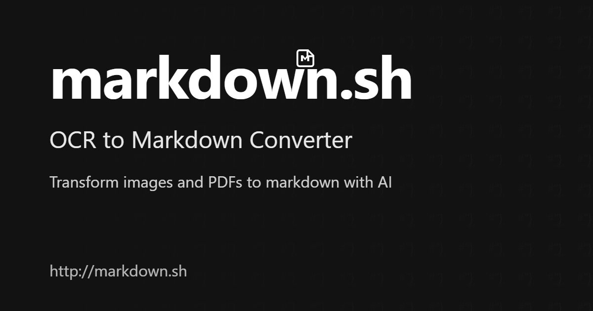

# markdown-sh - OCR to Markdown Converter

Transform images and PDFs to clean, formatted markdown with AI technology.



## Overview

markdown-sh is a powerful web application that converts images and PDFs to markdown using advanced OCR (Optical Character Recognition) and LLM (Large Language Model) technology. The application is built with Next.js and provides a seamless user experience for converting various document formats to clean, well-structured markdown.

## Features

- **Image Recognition**: Advanced OCR technology that accurately extracts text from images, including handwritten notes.
- **PDF Processing**: Extract and convert content from PDF documents while preserving the original structure.
- **AI-Powered Formatting**: Our LLM technology intelligently formats the extracted text into clean, structured markdown.
- **Lightning Fast**: Get your markdown in seconds, not minutes. Our optimized pipeline ensures quick processing.
- **Secure Processing**: Your files are processed securely and never stored permanently on our servers.
- **Code Block Detection**: Automatically detects and properly formats code blocks with the correct syntax highlighting.

## Getting Started

### Prerequisites

- Node.js 18.x or higher
- npm, yarn, pnpm, or bun

### Installation

1. Clone the repository:
```bash
git clone https://github.com/yourusername/markdown-sh.git
cd markdown-sh
```

2. Install dependencies:
```bash
npm install
# or
yarn install
# or
pnpm install
# or
bun install
```

3. Set up environment variables:
Create a `.env.local` file in the root directory with the following variables:
```
# Vercel Blob token
OCR_READ_WRITE_TOKEN=

# OpenAI Settings
OPENAI_API_KEY=
OPENAI_BASE_URL=https://api.openai.com/v1

# Model settings
FAST_MODEL=gpt-4o-mini
SLOW_MODEL=gpt-4o

# Client App Settings
NEXT_PUBLIC_APP_NAME=markdown.sh
NEXT_PUBLIC_CONTACT_EMAIL=malharujawane@gmail.com
NEXT_PUBLIC_APP_URL=https://localhost:3000

# Client App Markdown.sh API Key 
OCR_API_KEY=


# Neon DB connection details (Get from Vercel - Storage )
DATABASE_URL=

DATABASE_URL_UNPOOLED=

# Parameters for constructing your own connection string
PGHOST=
PGHOST_UNPOOLED=
PGUSER=
PGDATABASE=
PGPASSWORD=

# Parameters for Vercel Postgres Templates
POSTGRES_URL=
POSTGRES_URL_NON_POOLING=
POSTGRES_USER=
POSTGRES_HOST=
POSTGRES_PASSWORD=
POSTGRES_DATABASE=neondb
POSTGRES_URL_NO_SSL=
POSTGRES_PRISMA_URL=
```

4. Run the development server:
```bash
npm run dev
# or
yarn dev
# or
pnpm dev
# or
bun dev
```

5. Open [http://localhost:3000](http://localhost:3000) with your browser to see the application.

## Usage

1. Upload an image or PDF file by clicking the upload area or dragging and dropping a file.
2. Select the processing model (Fast or Accurate).
3. Wait for the OCR and AI processing to complete.
4. View and copy the generated markdown.

## Technologies Used

- [Next.js](https://nextjs.org/) - React framework
- [Framer Motion](https://www.framer.com/motion/) - Animation library
- [Vercel Blob Storage](https://vercel.com/docs/storage/vercel-blob) - File storage
- [Tailwind CSS](https://tailwindcss.com/) - CSS framework
- [Lucide Icons](https://lucide.dev/) - Icon library
- [OCR and LLM APIs](https://openai.com/) - For text extraction and formatting

## Deployment

The easiest way to deploy your Next.js app is to use the [Vercel Platform](https://vercel.com/new?utm_medium=default-template&filter=next.js&utm_source=create-next-app&utm_campaign=create-next-app-readme) from the creators of Next.js.

Check out the [Next.js deployment documentation](https://nextjs.org/docs/app/building-your-application/deploying) for more details.

## License

This project is licensed under the MIT License - see the LICENSE file for details.

## Acknowledgements

- [OpenAI](https://openai.com/) for providing the AI models
- [Vercel](https://vercel.com/) for hosting and Blob storage
- [Next.js](https://nextjs.org/) for the amazing framework
